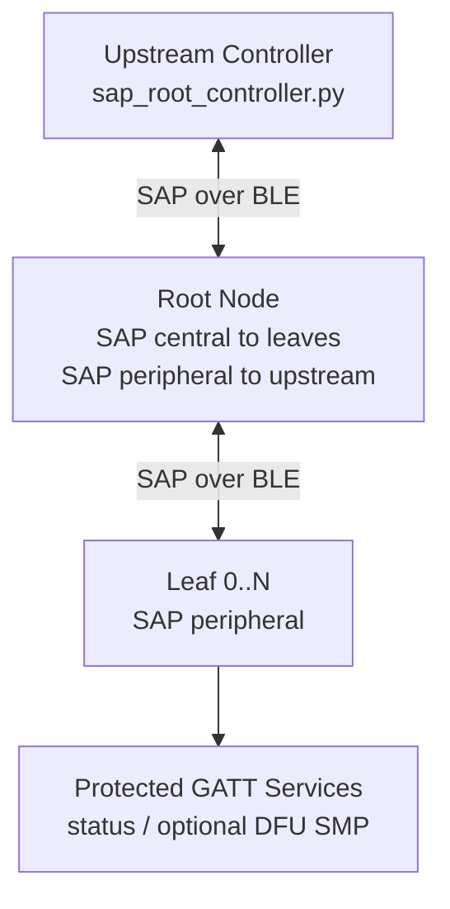
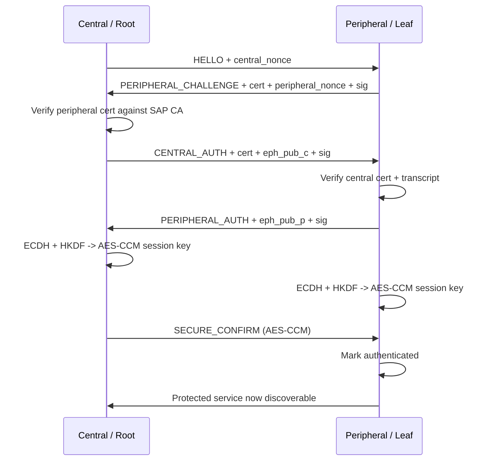
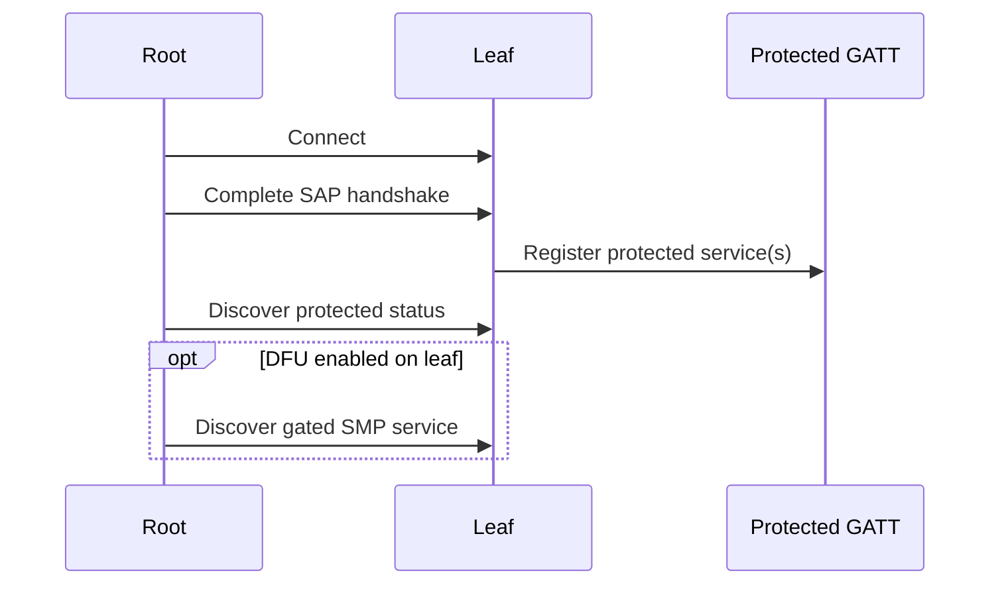

# Secure Application Pairing (SAP) for Zephyr

SAP is a Zephyr module that adds application-layer mutual authentication and a
post-auth secure channel on top of BLE. This repository contains:

- a reusable SAP library under `include/sap` and `subsys/bluetooth/sap`
- a reference demo under `samples/bluetooth/sap_demo`
- a Python controller under `scripts/sap_root_controller.py` that acts like an upstream app talking to a root node over BLE
- precompiled binaries for the sample under hex/

SAP adds a certificate-backed application identity check, derives a fresh session key, and only then exposes protected functionality (dynamic BLE services supported).

The demo also supports an alternate post-auth transport mode:

- default mode: SAP authenticates peers and then encrypts each app packet in a SAP AES-CCM secure frame
- BLE SC OOB mode: SAP authenticates peers, carries BLE Secure Connections OOB data inside the signed auth exchange, and then relies on the BLE L4 encrypted link instead of wrapping every app packet in SAP AEAD

## What The Module Does

- runs a mutual certificate-based challenge/response handshake over BLE
- optionally waits for normal BLE security first
- derives a fresh per-connection AES-CCM session key from ephemeral P-256 ECDH plus HKDF-SHA256
- wraps post-auth application messages in SAP secure frames, or optionally uses BLE L4 link security after SAP-authenticated LE SC OOB pairing
- lets the application register or expose services only after SAP succeeds

In the demo, the protected surface includes:

- a gated demo status service
- an optional gated Bluetooth MCUmgr SMP service for DFU

## Repository Layout

- `include/sap`: public protocol and service headers
- `subsys/bluetooth/sap`: reusable SAP implementation
- `samples/bluetooth/sap_demo`: reference root/leaf demo application
- `scripts/generate_demo_credentials.py`: generates the demo CA, device
  certificates, and credential blobs used by the sample
- `scripts/root_demo_credentials.py`: host-side credentials emitted by the
  generator for the Python controller
- `scripts/sap_root_controller.py`: upstream controller that authenticates to a
  root node and drives the demo control path
- `scripts/explain_sap_kmu.sh`: prints the recommended nRF54L15 KMU migration
  plan for the long-term identity signing key

## Roles In The Demo

- `Leaf`: a BLE peripheral that exposes the SAP control service, performs SAP
  as the peripheral role, and enables protected services only after SAP
  succeeds.
- `Root`: a BLE central toward leaves and, when `upstream_bleak.conf` is
  enabled, also a BLE peripheral toward an upstream controller. It authenticates
  leaves, tracks their status, and can relay commands.
- `Upstream controller`: a Python process that authenticates to the root over
  BLE and uses the root as an application-aware gateway.



## How The Protocol Works

SAP runs above BLE GATT. BLE still handles advertising, connection management,
discovery, ATT transport, and optional link encryption. SAP adds its own
identity check and its own secure application framing.

### Handshake

1. The central sends `HELLO` with a fresh central nonce.
2. The peripheral replies with `PERIPHERAL_CHALLENGE` containing its
   certificate, a fresh peripheral nonce, and a signature over the challenge
   transcript.
3. The central verifies the certificate against the SAP CA, generates an
   ephemeral ECDH key, and sends `CENTRAL_AUTH` with its certificate, ECDH
   public key, and transcript signature.
4. The peripheral verifies the central certificate and transcript, sends
   `PERIPHERAL_AUTH` with its ephemeral ECDH public key and final signature.
5. Both sides derive the same AES-CCM session key.
6. The central sends `SECURE_CONFIRM` as the first encrypted frame.
7. The peripheral marks the session authenticated and enables the protected
   application surface.



### Secure Frames

In the default transport mode, application traffic uses SAP secure frames. The secure
header is:

- `version`
- `message type`
- `8-byte random nonce base`
- `32-bit little-endian packet counter`

SAP builds the CCM nonce as:

- the per-packet random `nonce_base[8]`
- the packet counter `counter[4]`
- the message type `type[1]`

That yields the 13-byte nonce required by AES-CCM.

The session key is derived once per connection from:

- the ephemeral ECDH shared secret
- the two handshake nonces as HKDF salt
- a SHA-256 hash of the canonical transcript as HKDF `info`

The packet counter is still tracked per session so the receiver can reject
out-of-order or duplicated frames.

### Optional BLE SC OOB Mode

When `CONFIG_SAP_USE_BLE_SC_OOB_PAIRING=y` is enabled in the sample:

1. SAP still exchanges and verifies certificates at the application layer.
2. The central and peripheral include LE Secure Connections OOB data in the
   signed auth messages.
3. After `PERIPHERAL_AUTH`, both sides start BLE Security Level 4 pairing using
   the exchanged OOB values.
4. Once BLE L4 completes, SAP marks the session authenticated and sends
   application payloads as plaintext SAP records on the already encrypted BLE
   link.

That mode removes the extra SAP AES-CCM wrapping from each application packet
while still keeping the certificate-based SAP identity check. In the current
sample, this mode is used on root-to-leaf links. The upstream Python
controller-to-root link remains on the default SAP secure-frame transport.

## Gated Services

The always-present BLE surface is intentionally small: just the SAP service.
Everything interesting is behind SAP.

On the leaf:

- protected services are not registered before SAP succeeds
- protected services are registered in the authenticated callback
- protected services are removed again on disconnect or auth failure

In the sample, that means:

- the demo status characteristic only appears after SAP success
- the MCUmgr SMP service is optional and can also be hidden until SAP success



## Provisioning Model

### Demo Provisioning Today

The demo uses compile-time credentials.

`scripts/generate_demo_credentials.py` deterministically derives:

- one demo CA keypair
- one root identity (`device_id = 0`)
- one upstream host identity (`device_id = 42`)
- four peripheral identities (`device_id = 1..4`)

The script emits:

- `samples/bluetooth/sap_demo/src/demo_credentials.c`
- `scripts/root_demo_credentials.py`

That means the current demo is reproducible, but it is not a factory
provisioning flow. It is a bench/demo flow.

### How A Device Picks Its Identity

- BabbleSim peripherals map identity from the BabbleSim device number.
- Hardware peripherals pick identity with `CONFIG_SAP_DEMO_PERIPHERAL_ID`.
- The root always uses the root credential.
- The Python controller always uses the generated host credential.

The sample Kconfig currently provisions four hardware leaf identities:

- `device_id = 1`
- `device_id = 2`
- `device_id = 3`
- `device_id = 4`

### What Should Be Provisioned In Production

For a production design, the long-term identity signing key should not live as a
raw compiled byte array. The recommended direction on nRF54L15 is:

- keep the CA public key, certificate, and policy outside KMU
- move the long-term SAP identity private key into KMU / PSA-backed storage
- keep ephemeral ECDH keys and per-session AES keys volatile

`scripts/explain_sap_kmu.sh` prints the recommended PSA attributes and
`nrfutil device x-provision-keys` command template. It explains the migration
plan; it does not provision the board by itself.

## Build And Run

Per the local workspace instructions, source the NCS helper before building:

```bash
source ./activate-nrf.sh
export SAP_MODULE_ROOT=/home/h/Documents/Nordic/sap-zephyr-module
```

### Build A Root With Upstream BLE Control Enabled

```bash
west build -p --no-sysbuild \
  -d build-sap-root \
  -b nrf54l15dk/nrf54l15/cpuapp \
  --extra-conf central.conf \
  --extra-conf upstream_bleak.conf \
  --extra-conf demo_logging.conf \
  "$SAP_MODULE_ROOT/samples/bluetooth/sap_demo" -- \
  -DEXTRA_ZEPHYR_MODULES="$SAP_MODULE_ROOT"
```

### Build A Root/Leaf Setup With BLE SC OOB Transport

This is the mode that was tested on three `nrf54l15dk` boards:

```bash
west build -p --no-sysbuild \
  -d build-sap-oob-root \
  -b nrf54l15dk/nrf54l15/cpuapp \
  --extra-conf central.conf \
  --extra-conf upstream_bleak.conf \
  --extra-conf demo_logging.conf \
  "$SAP_MODULE_ROOT/samples/bluetooth/sap_demo" -- \
  -DEXTRA_ZEPHYR_MODULES="$SAP_MODULE_ROOT" \
  -DCONFIG_SAP_USE_BLE_SC_OOB_PAIRING=y

west build -p --no-sysbuild \
  -d build-sap-oob-leaf \
  -b nrf54l15dk/nrf54l15/cpuapp \
  --extra-conf peripheral.conf \
  --extra-conf peripheral_no_dfu.conf \
  --extra-conf demo_logging.conf \
  "$SAP_MODULE_ROOT/samples/bluetooth/sap_demo" -- \
  -DEXTRA_ZEPHYR_MODULES="$SAP_MODULE_ROOT" \
  -DCONFIG_SAP_USE_BLE_SC_OOB_PAIRING=y \
  -DCONFIG_SAP_DEMO_PERIPHERAL_ID=1

west build -p --no-sysbuild \
  -d build-sap-oob-leaf-id2 \
  -b nrf54l15dk/nrf54l15/cpuapp \
  --extra-conf peripheral.conf \
  --extra-conf peripheral_no_dfu.conf \
  --extra-conf demo_logging.conf \
  "$SAP_MODULE_ROOT/samples/bluetooth/sap_demo" -- \
  -DEXTRA_ZEPHYR_MODULES="$SAP_MODULE_ROOT" \
  -DCONFIG_SAP_USE_BLE_SC_OOB_PAIRING=y \
  -DCONFIG_SAP_DEMO_PERIPHERAL_ID=2
```

The validated live result after flashing was:

- root shell `sap peers`:
  - `peer_id=1 state=authenticated security_ready=1 authenticated=1 protected=1 dfu=0 led=LED1 pattern=1 selected=0`
  - `peer_id=2 state=authenticated security_ready=1 authenticated=1 protected=1 dfu=0 led=LED2 pattern=1 selected=0`
- leaf 1 shell `sap status`:
  - `connected=1 authenticated=1 protected=1 dfu=0 central_id=0 button1=0 pattern=1`
- leaf 2 shell `sap status`:
  - `connected=1 authenticated=1 protected=1 dfu=0 central_id=0 button1=0 pattern=1`
- upstream controller `status`:
  - `peer_id=1 state=7 flags=auth,protected,led led_index=1 pattern_id=1`
  - `peer_id=2 state=7 flags=auth,protected,led led_index=2 pattern_id=1`
- upstream controller `select 1`:
  - `select_status=0 selected_peer_id=1`

### Build A Leaf

```bash
west build -p --no-sysbuild \
  -d build-sap-leaf \
  -b nrf54l15dk/nrf54l15/cpuapp \
  --extra-conf peripheral.conf \
  --extra-conf peripheral_no_dfu.conf \
  --extra-conf demo_logging.conf \
  "$SAP_MODULE_ROOT/samples/bluetooth/sap_demo" -- \
  -DEXTRA_ZEPHYR_MODULES="$SAP_MODULE_ROOT"
```

To build a different hardware leaf identity, pass the Kconfig value directly:

```bash
west build -p --no-sysbuild \
  -d build-sap-leaf-id2 \
  -b nrf54l15dk/nrf54l15/cpuapp \
  --extra-conf peripheral.conf \
  --extra-conf peripheral_no_dfu.conf \
  --extra-conf demo_logging.conf \
  "$SAP_MODULE_ROOT/samples/bluetooth/sap_demo" -- \
  -DEXTRA_ZEPHYR_MODULES="$SAP_MODULE_ROOT" \
  -DCONFIG_SAP_DEMO_PERIPHERAL_ID=2
```

### Flash

```bash
west flash -d build-sap-root --dev-id <root-jlink-serial>
west flash -d build-sap-leaf --dev-id <leaf-jlink-serial>
```

### Verify From The Root Shell

```text
sap peers
```

That reports the authenticated leaf IDs and flags such as:

- `auth`
- `protected`
- `dfu`
- `led`

### Verify From The Upstream Python Controller

```bash
python3 "$SAP_MODULE_ROOT/scripts/sap_root_controller.py" --name SAP-C-0 status
```

That script:

- scans for the root node
- authenticates to it using the generated host certificate
- establishes the SAP secure channel
- queries the root for the authenticated leaf table

## Compared With A Competitor's Certificate Authentication

A competitor's certificate-authentication design and this SAP module solve related problems,
but they are not the same design.

### Similarities

- both use certificates to avoid weak manual pairing flows
- both aim to establish trust without QR codes, passkeys, or NFC side channels
- both are designed to prove that a device belongs to an expected fleet or
  manufacturer

### Differences

| Topic | This SAP repo | Competitor certificate-authentication approach |
| --- | --- | --- |
| Layer | Application-layer protocol over custom BLE GATT | Pairing/authentication flow tied to BLE pairing |
| When trust is established | After BLE connect, optionally after BLE link encryption | During certificate-based pairing |
| Post-auth transport | Default: SAP AES-CCM secure frames. Optional sample mode: SAP-authenticated BLE SC OOB followed by BLE L4 link transport | Standard authenticated encrypted BLE link after pairing |
| Trust material | App-owned CA and certificates generated or provisioned by the product | Vendor-owned device certificate / secure element flow |
| Service gating | Explicitly hides protected services until SAP succeeds | Pairing authenticates the link; application gating is separate |
| Topology | Root-to-many-leaf demo plus upstream controller | Documented primarily as authenticated peer pairing |

Competitor certificate-authentication systems push more of the trust decision down into the BLE pairing
layer. This repo deliberately keeps an application-owned certificate exchange
and policy check above BLE, even when it can also carry LE Secure Connections
OOB material.

### Why Not Use Only OOB Pairing?

Pure stack-level OOB pairing is not enough for every deployment target.

In particular, mobile platforms such as iOS do not permit OOB pairing. Because of that, this repo keeps the SAP certificate handshake and policy layer explicit:

## Current Limits And Intentional Demo Simplifications

- The demo credentials are generated locally and compiled into the sample.
- The root/leaf identity space is currently fixed to the IDs emitted by the
  demo credential generator.
- The sample shows how to gate DFU, but that DFU behavior is a sample feature,
  not a requirement of the SAP library itself.
